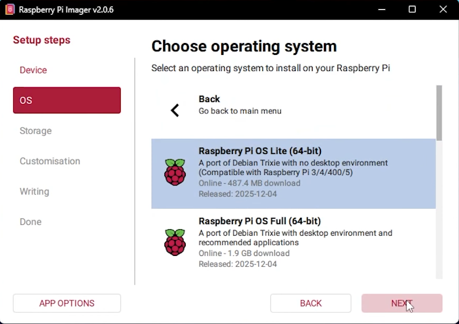
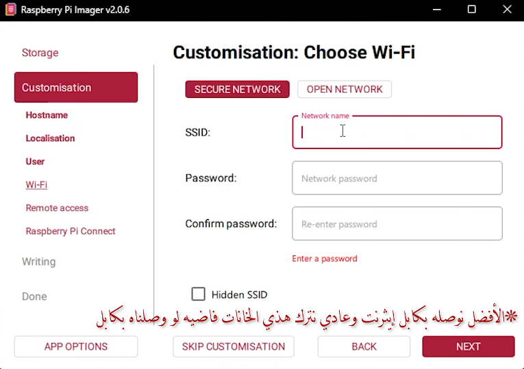
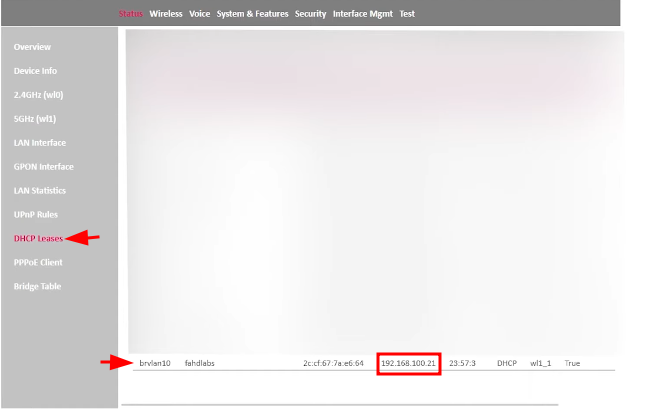
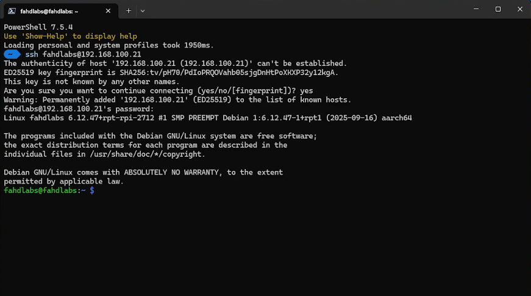
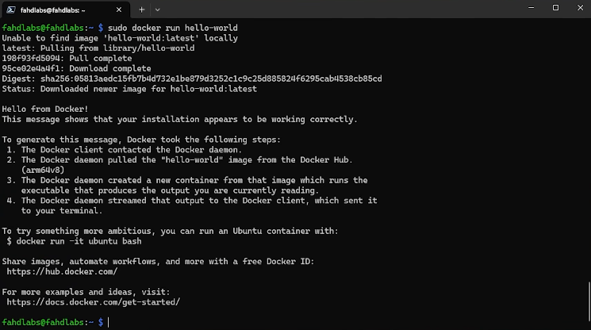

هذا الدليل هو نسخة مكتوبة وموسعة من الفيديو:


إذا هدفك تحوّل الراسبيري باي إلى سيرفر منزلي (Homelab)، فهذا هو المسار الصحيح للبداية.

## لماذا اخترنا Raspberry Pi OS Lite بدل Desktop؟

- لأننا نبني **سيرفر** وليس جهاز استخدام يومي بواجهة رسومية.
- نسخة Lite تستهلك RAM أقل، وهذا يعطي موارد أكثر للخدمات مثل Docker.
- التحديثات غالبًا أخف وأسرع.
- إدارة السيرفر عبر SSH تكفي في أغلب سيناريوهات Homelab.

## ماذا ستتعلم في هذا الشرح؟

- تفليش نظام Raspberry Pi OS Lite بالطريقة الصحيحة.
- تجهيز الإعدادات قبل التشغيل الأول (Wi-Fi + Username + SSH).
- الدخول على الجهاز عبر SSH.
- تحديث النظام بدون أخطاء شائعة.
- تثبيت Docker وDocker Compose وتشغيل أول حاوية للتأكد أن كل شيء يعمل.

## المتطلبات

- Raspberry Pi 5 (وأي موديل حديث غالبًا يمشي بنفس الخطوات).
- بطاقة microSD جيدة.
- قارئ بطاقة على الكمبيوتر.
- إنترنت.
- راوتر منزلي.

## 1) تنزيل Raspberry Pi Imager وتثبيت النظام

1. ادخل موقع Raspberry Pi الرسمي وحمّل [Raspberry Pi Imager](https://www.raspberrypi.com/software/).
2. افتح البرنامج واختر:
- `Choose Device`: اختر جهازك (مثل Raspberry Pi 5).
- `Choose OS`: اختر `Raspberry Pi OS (other)` ثم `Raspberry Pi OS Lite (64-bit)`.
- `Choose Storage`: اختر بطاقة الذاكرة الصحيحة.

نسخة Lite مناسبة للسيرفر لأنها أخف من نسخة سطح المكتب.



## 2) الإعدادات المهمة قبل التفليش (OS Customization)

قبل ما تضغط `Write`، فعّل هذه الخيارات:

- `Hostname`: مثل `fahdlabs`.
> ملاحظة الهوست نيم تقدر تستخدمه لما تدخل على الباي عن طريق هذا العنوان بدال الايبي:
> HOSTNAME.local
> بس تضيف على الاسم الي اخترته ".local"
- `Username/Password`: حساب الدخول.
- `Configure wireless LAN`: إذا كنت تستخدم Wi-Fi.
- `Set locale settings`: المنطقة الزمنية ولوحة المفاتيح.
- `Enable SSH`: واختر `Use password authentication`.

هذه الخطوة تختصر عليك توصيل شاشة/كيبورد للراسبيري.



## 3) الإقلاع الأول ومعرفة IP الجهاز

1. افصل البطاقة من الكمبيوتر.
2. ركبها في Raspberry Pi وشغّل الجهاز.
3. انتظر من دقيقة إلى 5 دقائق.
4. ادخل صفحة الراوتر وابحث عن الجهاز في DHCP clients أو DHCP leases.
5. انسخ عنوان الـ IP.



## 4) الدخول عبر SSH

من التيرمنال في جهازك:

```bash
ssh USERNAME@IP_ADDRESS
```

مثال:

```bash
ssh fahad@192.168.1.21
```

أول مرة سيطلب تأكيد البصمة الأمنية، اكتب:

```bash
yes
```

ثم أدخل كلمة المرور.

لو كان `hostname.local` يعمل عندك، تستطيع الدخول أيضًا بهذه الطريقة:

```bash
ssh USERNAME@HOSTNAME.local
```




## 5) تحديث النظام

بعد تسجيل الدخول:

```bash
sudo apt update
sudo apt upgrade -y
```

هذه خطوة أساسية قبل تثبيت أي خدمة.

## 6) تثبيت Docker + Docker Compose

[رابط شرح التثبيت من موقع دوكر الرسمي](https://docs.docker.com/engine/install/debian/).
حسب الطريقة الرسمية على Debian/Raspberry Pi OS:

```bash
curl -fsSL https://get.docker.com | sh
sudo usermod -aG docker $USER
```

بعدها سجّل خروج وادخل مرة ثانية (أو أعد تشغيل الجلسة) لتفعيل صلاحيات مجموعة `docker` بدون `sudo`.

تحقق أن Docker يعمل:

```bash
docker ps
```

## 7) اختبار سريع: تشغيل أول حاوية

```bash
docker run --rm hello-world
```

إذا ظهرت رسالة النجاح، فـ Docker شغال بشكل صحيح.



## الأخطاء الشائعة وحلولها

### 1. `Permission denied while trying to connect to the Docker daemon`

المشكلة: المستخدم ليس ضمن مجموعة Docker أو لم تُحدّث الجلسة.
الحل:

```bash
sudo usermod -aG docker $USER
```

ثم أعد تسجيل الدخول.

### 2. ما أقدر أدخل SSH

تأكد من:

- تفعيل SSH في إعدادات Imager.
- نفس شبكة الراوتر.
- IP صحيح من صفحة الراوتر.

### 3. الجهاز يعطي IP مختلف بعد كل إعادة تشغيل

هذا طبيعي مع DHCP. الحل الكامل هنا:

[شرح تثبيت IP ثابت على Raspberry Pi](/post/raspberry-pi-static-ip-networkmanager/)

## FAQ (أسئلة شائعة)

### هل لازم Raspberry Pi 5؟

لا. غالبًا نفس الخطوات تمشي على Pi 4 وPi 3 (مع اختلاف الأداء).

### هل أستخدم نسخة Desktop أو Lite؟

إذا هدفك سيرفر، استخدم `Lite` لأنها أخف وأفضل للخدمات.

### هل أقدر أبدأ مباشرة بـ Docker مشاريع؟

نعم، وبعدها تقدر تستخدم Dockge لتسهيل إدارة `docker-compose`:

[شرح Dockge كامل](/post/dockge-docker-compose-manager/)

## المصادر الرسمية (للتحديثات)

- Raspberry Pi Imager: https://www.raspberrypi.com/software/
- Raspberry Pi Documentation (Remote Access / SSH): https://www.raspberrypi.com/documentation/computers/remote-access.html
- Docker Engine on Debian: https://docs.docker.com/engine/install/debian/
- Docker Linux Post-installation: https://docs.docker.com/engine/install/linux-postinstall/

## الخلاصة

بهذه الخطوات صار عندك Raspberry Pi جاهز كسيرفر أساسي: دخول عن بعد + نظام محدث + Docker يعمل. هذا الأساس الذي تبني عليه باقي السلسلة.
