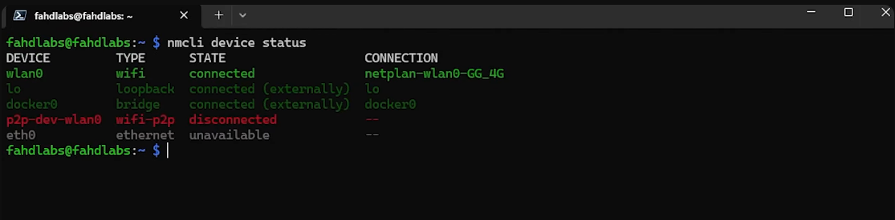
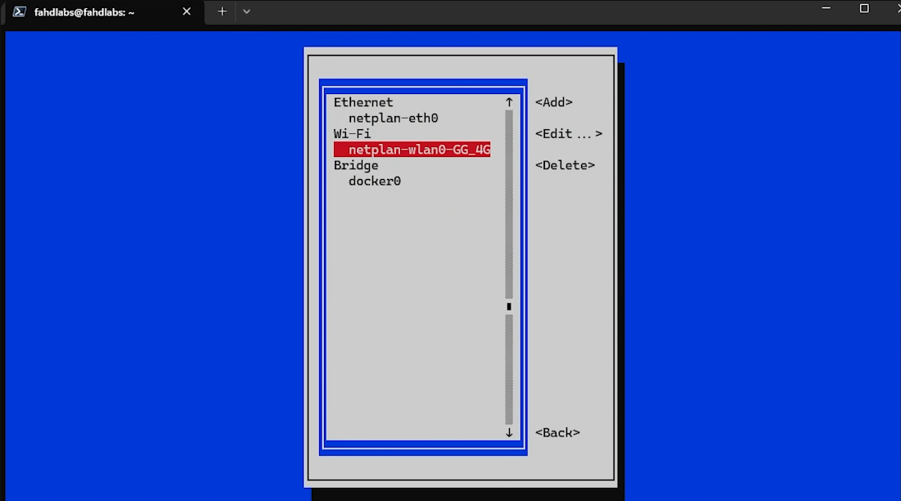
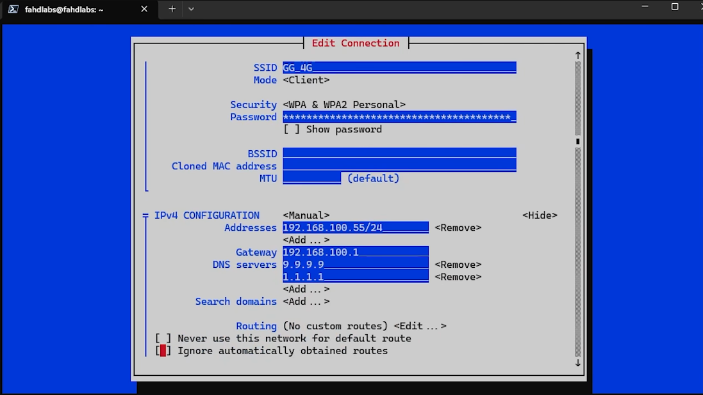
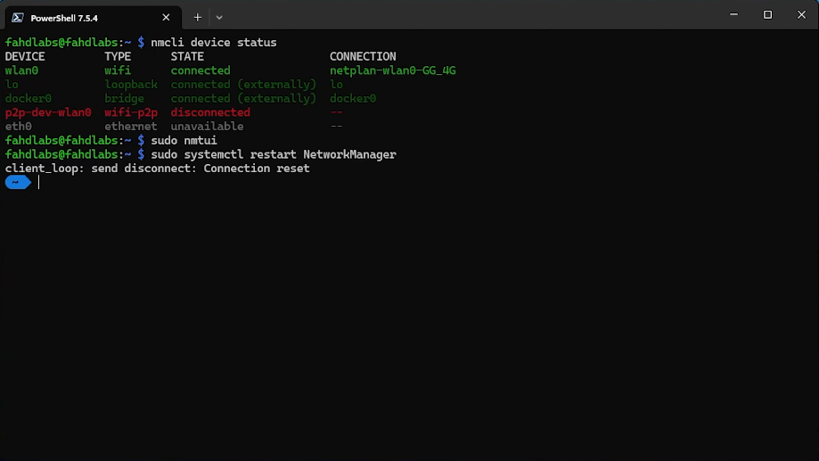
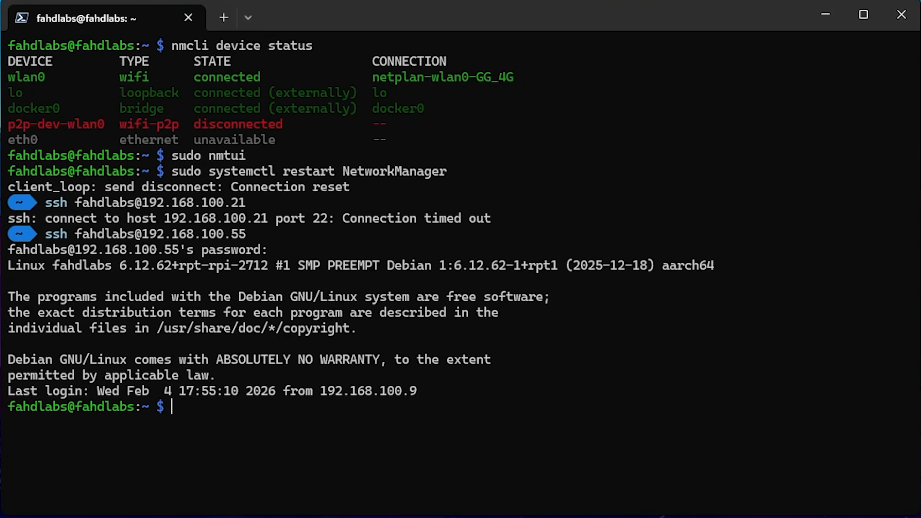

هذا الدليل هو نسخة مكتوبة وموسعة من الفيديو:


إذا كنت تشغل Docker أو أي خدمة منزلية، فأهم خطوة بعد الإعداد الأول هي تثبيت عنوان IP ثابت.

## لماذا تحتاج Static IP؟

بدون IP ثابت، الراوتر ممكن يعطي جهازك IP جديد بعد إعادة تشغيل:

- الراوتر نفسه.
- الراسبيري باي.
- أو بعد انتهاء مدة DHCP Lease.

هذا يسبب توقف الروابط، وفشل الوصول للخدمات، ومشاكل في التطبيقات المرتبطة بعنوان قديم.

## نقطة مهمة قبل البدء

على Raspberry Pi OS 12 (Bookworm)، الأفضل استخدام `NetworkManager` بدل الطرق القديمة المعتمدة على `dhcpcd`.

السبب: كثير من الشروحات القديمة تعتمد ملفات لم تعد المسار الرسمي في Bookworm، وهذا يسبب لخبطة عند المبتدئين.

## 1) الدخول على الراسبيري باي عبر SSH

```bash
ssh USERNAME@CURRENT_IP
```

## 2) جمع معلومات الشبكة الحالية

شغّل:

```bash
nmcli device show
```

دوّن هذه القيم:

- `IP4.ADDRESS[1]` (مثل `192.168.100.21/24`)
- `IP4.GATEWAY` (مثل `192.168.100.1`)

ثم اعرف اسم الاتصال الفعّال (Wi-Fi أو Ethernet):

```bash
nmcli device status
```



## 3) فتح واجهة الإعداد النصية nmtui

```bash
sudo nmtui
```

ثم:

1. اختر `Edit a connection`.
2. اختر الاتصال المطلوب:
- Wi-Fi لو كنت متصل لاسلكيًا.
- Wired connection لو كنت عبر كيبل Ethernet.
3. عند `IPv4 Configuration` غيّرها من `Automatic` إلى `Manual`.
4. في `Addresses` ضع IP ثابت غير مستخدم، مثال:
- `192.168.100.55/24`
5. في `Gateway` ضع عنوان الراوتر، مثال:
- `192.168.100.1`
6. في `DNS servers` أضف DNS، مثال:
- `9.9.9.9`
- `1.1.1.1`
7. احفظ الإعدادات (`OK`).

نصيحة بسيطة: اختر IP ثابت خارج المجال الذي يستخدمه DHCP التلقائي في الراوتر إذا كنت تقدر تغيّره، لتقليل احتمال التعارض.




## 4) تطبيق الإعدادات وإعادة تشغيل NetworkManager

```bash
sudo systemctl restart NetworkManager
```

ملاحظة: جلسة SSH غالبًا ستنفصل مباشرة، وهذا طبيعي.



## 5) تسجيل الدخول بالـ IP الجديد

أعد الاتصال باستخدام العنوان الثابت الجديد:

```bash
ssh USERNAME@192.168.100.55
```



## 6) تأكيد أن الإعداد ثابت

تحقق:

```bash
ip a
nmcli device show
```

أعد تشغيل الجهاز للتأكد النهائي:

```bash
sudo reboot
```

وبعد الإقلاع تأكد أن نفس الـ IP ما تغيّر.

## Wi‑Fi vs Ethernet: نفس الفكرة

الفرق فقط في الاتصال الذي تختاره داخل `nmtui`:

- Wi-Fi: اختر اسم شبكة الواي فاي.
- Ethernet: اختر الاتصال السلكي.

باقي الخطوات متطابقة.

## أخطاء شائعة وحلولها

### 1. IP تعارض مع جهاز ثاني

الأعراض: انقطاع متكرر أو عدم وصول.
الحل: اختر IP غير مستخدم من الراوتر (يفضل رقم بعيد مثل 50+).

### 2. كتبت Gateway أو Mask بشكل غلط

الأعراض: الجهاز متصل محليًا لكن بدون إنترنت.
الحل: راجع القيم من `nmcli device show` قبل التعديل.

### 3. الرجوع للـ IP القديم بعد إعادة التشغيل

الأسباب المحتملة:

- لم تحفظ الإعداد في `nmtui` بشكل صحيح.
- أُجري التعديل على اتصال غير فعّال.

الحل: كرر الخطوات وتأكد من اسم الاتصال في `nmcli device status`.

## FAQ

### هل أحتاج DNS يدوي؟

ليس إلزاميًا، لكن مفيد لتحسين الاستقرار والتحكم (خصوصًا عند تشغيل AdGuard Home لاحقًا).

### هل Static IP أفضل من DHCP Reservation في الراوتر؟

الاثنان جيدان:

- `Static IP على الجهاز`: واضح وسهل تتبعه داخل نفس السيرفر.
- `DHCP Reservation في الراوتر`: إدارة مركزية من مكان واحد.

ملاحظة: لو راوترك يدعم DHCP Reservation بشكل واضح فهذا خيار ممتاز. إذا ما يدعم أو واجهته محدودة، التثبيت من داخل Raspberry Pi هو الحل الأبسط.

إذا كنت في بداية الهوم لاب، ابدأ بطريقة واحدة فقط والتزم بها حتى لا تتداخل الإعدادات.

### هل هذه الخطوات تنفع مع Pi-hole أو AdGuard؟

نعم، بل تعتبر خطوة أساسية قبل تشغيل أي DNS server منزلي.

## المصادر الرسمية (للتحديثات)

- NetworkManager `nmcli`: https://networkmanager.pages.freedesktop.org/NetworkManager/NetworkManager/nmcli.html
- NetworkManager `nmtui`: https://networkmanager.pages.freedesktop.org/NetworkManager/NetworkManager/nmtui.html

## الخلاصة

بعد تثبيت Static IP، يصبح سيرفرك ثابتًا ويمكن الاعتماد عليه للخدمات القادمة مثل Dockge وAdGuard Home بدون مشاكل تغيّر العنوان.
