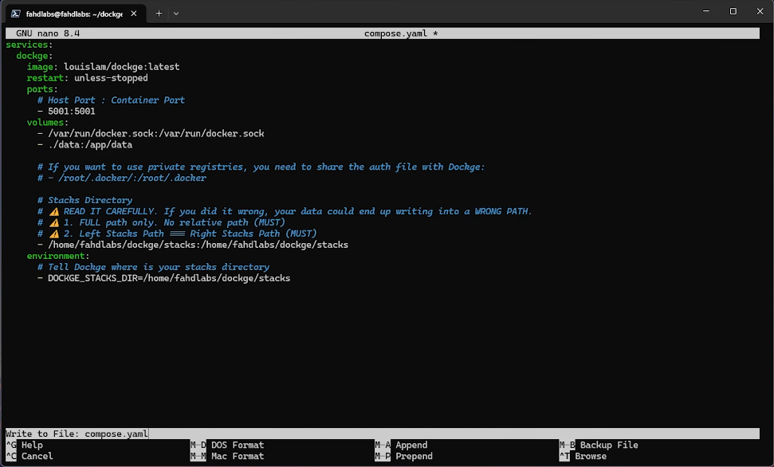
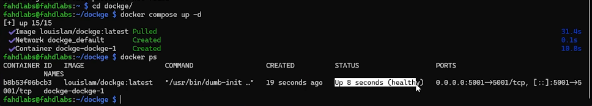
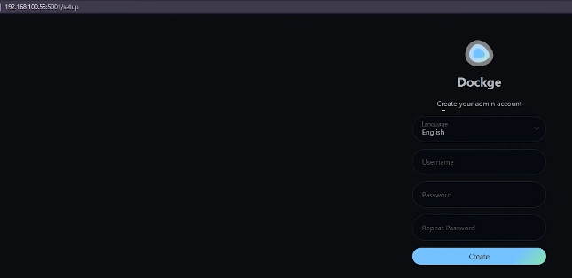
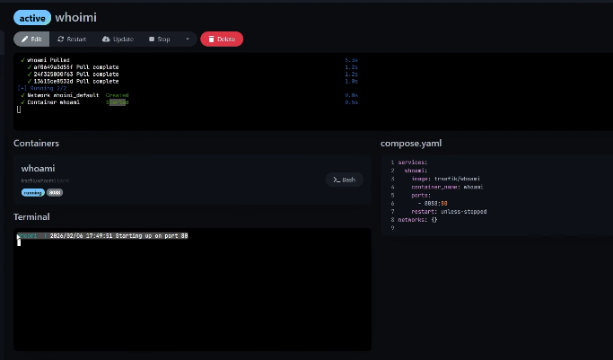

هذا الدليل هو نسخة مكتوبة وموسعة من الفيديو:


إذا تستخدم Docker Compose وتبغى إدارة أسهل من التيرمنال، Dockge يعطيك لوحة بسيطة وسريعة بدون تعقيد.

## ما هو Dockge؟

Dockge أداة مفتوحة المصدر لإدارة مشاريع `docker-compose` من واجهة ويب.

تقدر من خلالها:

- إنشاء Stack جديد.
- تشغيل/إيقاف/تحديث الخدمات.
- تعديل `compose.yaml` مباشرة.
- قراءة Logs من نفس الواجهة.

متى يكون Dockge مناسب لك؟

- عندك سيرفر واحد أو بيئة منزلية صغيرة.
- تستخدم `docker-compose` بشكل يومي.
- تبغى واجهة بسيطة بدون تعقيد أدوات أكبر.

## قبل التثبيت

- Docker + Docker Compose يجب أن يكونا جاهزين.
- يفضل أن يكون الراسبيري باي له IP ثابت.

إذا لم تجهّزها بعد:

- [إعداد Raspberry Pi + Docker](/post/raspberry-pi-5-setup-ssh-docker/)
- [تثبيت IP ثابت](/post/raspberry-pi-static-ip-networkmanager/)

## 1) إنشاء مجلد العمل

```bash
mkdir -p ~/dockge
cd ~/dockge
```

## 2) إنشاء ملف compose.yaml لـ Dockge

```bash
nano compose.yaml
```

ضع هذا المحتوى:

```yaml
services:
  dockge:
    image: louislam/dockge:latest
    container_name: dockge
    restart: unless-stopped
    ports:
      - "5001:5001"
    volumes:
      - /var/run/docker.sock:/var/run/docker.sock
      - ./data:/app/data
      - /full/path/to/folder/stacks:/full/path/to/folder/stacks
    environment:
      - DOCKGE_STACKS_DIR=/full/path/to/folder/stacks
```
ثم احفظ الملف من خلال الضغط على
- ctrl+x 
- y
- enter

ملاحظة مهمة:
> لازم المسار الي فيه ال ستاكس يكون مسار كامل مسار الداتا عادي يكون نسبي
- نسبي مثل: ./data
- كامل مثل: /home/fahdlabs/dockge/stacks
- ومسار الستاكس لازم اليمين يكون نفس اليسار
- مسار `DOCKGE_STACKS_DIR` لازم يطابق المسار المربوط في `volumes`.



## 3) تجهيز المجلدات المطلوبة

```bash
mkdir -p data stacks
```

## 4) تشغيل Dockge

```bash
docker compose up -d
```

تحقق:

```bash
docker ps
```



## 5) فتح الواجهة وإنشاء حساب Admin

من المتصفح:

```text
http://RASPBERRY_PI_IP:5001
```

أول دخول سيطلب إنشاء حساب مدير.



## 6) إنشاء أول Stack تجريبي (whoami)

من داخل Dockge:

1. اضغط `+ Compose`.
2. سمّ الـ Stack: `whoami`.
3. ألصق ملف Compose التالي:

```yaml
services:
  whoami:
    image: traefik/whoami
    container_name: whoami
    restart: unless-stopped
    ports:
      - "8080:80"
```

4. احفظ.
5. اضغط `Start`.

اختبر الخدمة:

```text
http://RASPBERRY_PI_IP:8080
```

ليش `whoami`؟ لأنها خدمة اختبار خفيفة جدًا وتأكد بسرعة أن مسار Dockge كامل شغال من البداية للنهاية.



## 7) أهم المميزات العملية في Dockge

- `Logs`: لمتابعة مشاكل التشغيل بسرعة.
- `Edit`: تعديل Compose بدون الرجوع للتيرمنال.
- `Stop/Start/Restart`: إدارة سريعة لكل Stack.
- `Update`: سحب أحدث صورة وإعادة التشغيل.

## هيكلة منظمة مقترحة لمشاريعك

داخل `~/dockge/stacks/` اجعل كل خدمة في مجلد مستقل:
> دوكجي يسويها لك بهذا الشكل من نفسه
```text
stacks/
  adguard/
    compose.yaml
  immich/
    compose.yaml
  uptime-kuma/
    compose.yaml
```

هذا يسهل النسخ الاحتياطي والمتابعة.

## أخطاء شائعة وحلولها

### 1. `docker: permission denied`

أضف المستخدم لمجموعة docker:

```bash
sudo usermod -aG docker $USER
```

ثم أعد تسجيل الدخول.

### 2. `no such file or directory: compose.yaml`

شغّلت الأمر من مجلد غير صحيح.
الحل: ادخل `~/dockge` ثم أعد التنفيذ.

### 3. Stack لا يظهر في Dockge

تأكد أن:

- قيمة `DOCKGE_STACKS_DIR` نفس المسار الكامل الذي اخترته للـ stacks.
- مثال صحيح:

```yaml
volumes:
  - /home/USERNAME/dockge/stacks:/home/USERNAME/dockge/stacks
environment:
  - DOCKGE_STACKS_DIR=/home/USERNAME/dockge/stacks
```

## FAQ

### هل Dockge بديل كامل لـ Portainer؟

ليس نفس الفلسفة. Dockge أخف ومركز على Docker Compose بشكل مباشر وبسيط.

قاعدة سريعة:

- إذا تريد إدارة Compose بسرعة وبشكل واضح: Dockge ممتاز.
- إذا تريد إدارة أوسع (Swarm/Features كثيرة): فكر لاحقًا بأدوات أكبر.

### هل ينفع على سيرفر واحد منزلي؟

نعم، وهذه أفضل حالة استخدام له.

### هل يدعم العربية؟

نعم، يوجد دعم واجهة عربي ويمكن تغييره من الإعدادات.

## المصادر الرسمية (للتحديثات)

- Dockge Official Website: https://dockge.kuma.pet/
- Dockge GitHub: https://github.com/louislam/dockge
- Docker Compose Documentation: https://docs.docker.com/compose/

## الخلاصة

Dockge يعطيك طريقة سريعة ومرتبة لإدارة `docker-compose` في الهوم لاب. وهو تجهيز ممتاز قبل تشغيل خدمات مثل AdGuard Home.
