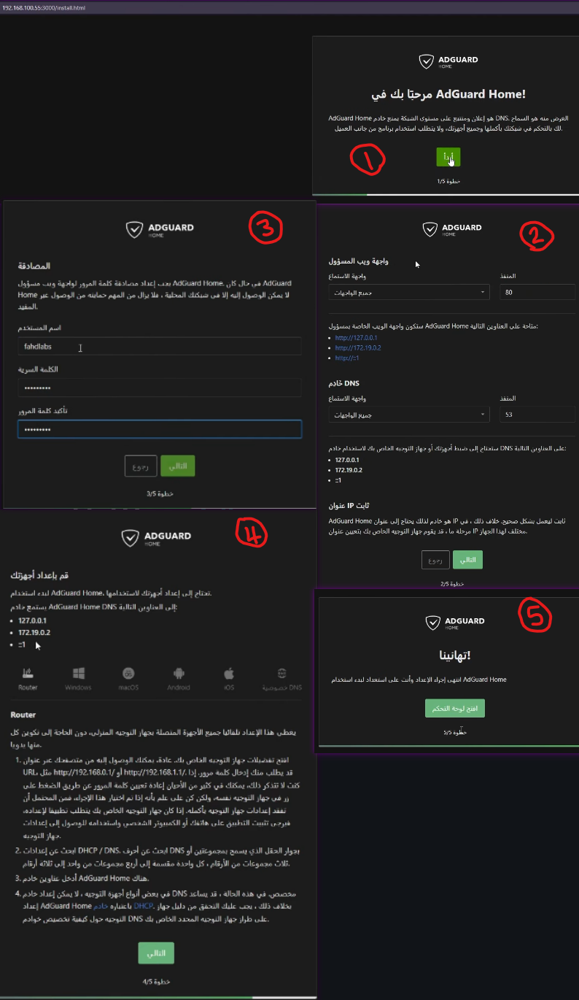
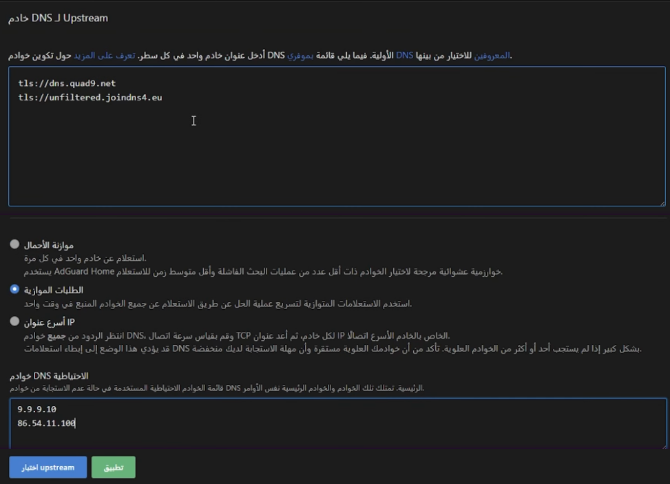
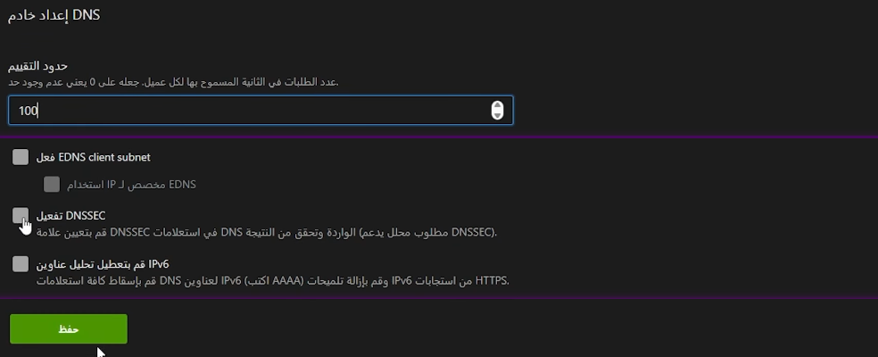
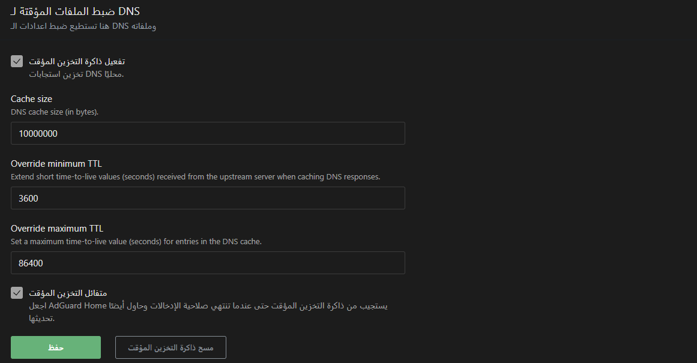
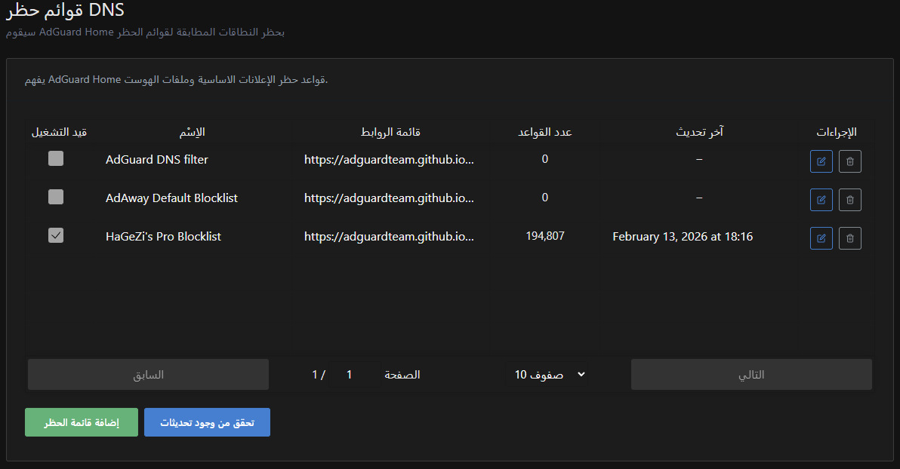
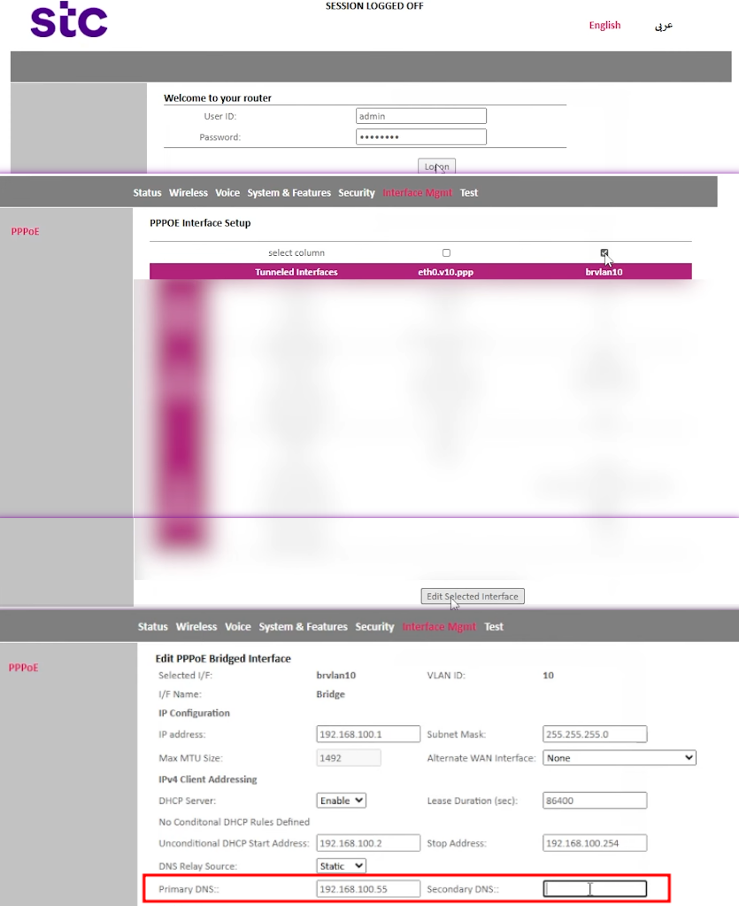
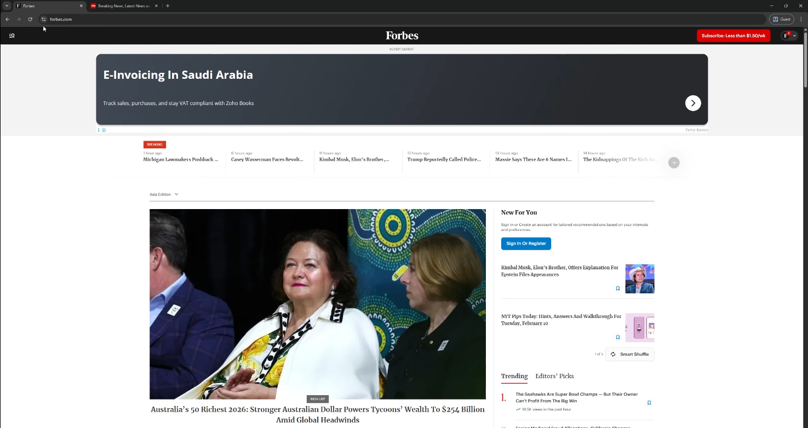
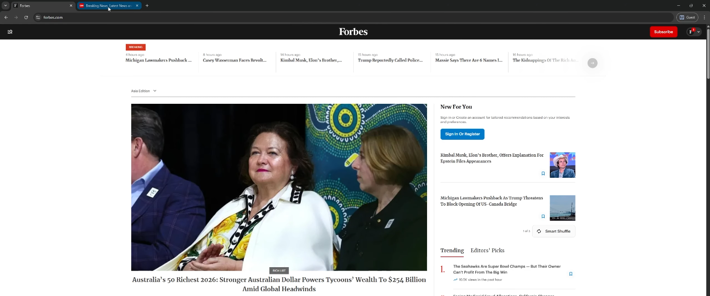
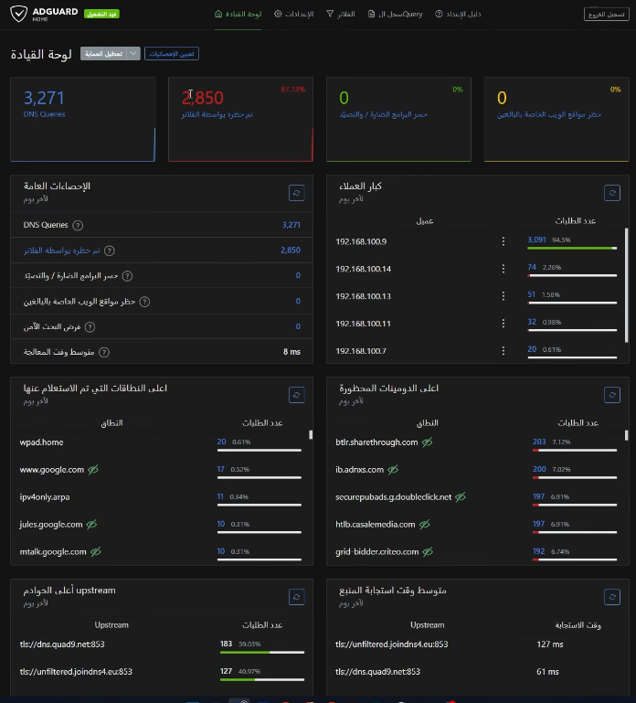

هذا الدليل هو نسخة مكتوبة وموسعة من الفيديو:


إذا تبغى تحجب الإعلانات والتتبع من كل أجهزة البيت (جوال، كمبيوتر، تلفزيون)، الحل العملي هو DNS مركزي داخل الشبكة.

## فكرة AdGuard Home باختصار

بدل ما كل جهاز يستخدم DNS عام مباشرة، نخلي طلبات DNS تمر عبر AdGuard Home داخل الشبكة المنزلية. وقتها:

- دومينات الإعلانات تُحجب قبل التحميل.
- يقل التتبع.
- تقدر تحجب مواقع محددة على مستوى البيت كامل.

بمعنى أبسط: بدل ما كل جهاز يحاول يحجب الإعلانات بنفسه، تخلي الشبكة كلها تمر من فلتر واحد.

## المتطلبات

- جهاز يشغل Docker (Raspberry Pi أو جهاز قديم).
- عنوان IP ثابت لهذا الجهاز.
- وصول لإعدادات الراوتر.

## الطريقة 1 (مثل الفيديو): التشغيل عبر Dockge

إذا عندك Dockge، أنشئ Stack جديد لـ AdGuard Home وشغّله.

متى تختار هذه الطريقة؟ إذا أنت أصلًا تدير خدماتك من Dockge وتبغى كل شيء في مكان واحد.

## الطريقة 2: Docker Compose مباشر (بدون Dockge)

### 1) إنشاء المجلدات

```bash
mkdir -p ~/adguard/{work,conf}
cd ~/adguard
```

### 2) إنشاء ملف `docker-compose.yml`

```bash
nano docker-compose.yml
```

### 3) ألصق الإعداد التالي

```yaml
services:
  adguardhome:
    image: adguard/adguardhome:latest
    container_name: adguardhome
    restart: unless-stopped
    environment:
      - TZ=Asia/Riyadh
    volumes:
      - ./work:/opt/adguardhome/work
      - ./conf:/opt/adguardhome/conf
    ports:
      - "3000:3000"   # صفحة الإعداد أول مرة
      - "80:80"       # لوحة التحكم بعد الإعداد
      - "53:53/tcp"   # DNS TCP
      - "53:53/udp"   # DNS UDP
```

### 4) تشغيل الخدمة

```bash
docker compose up -d
```

### 5) التأكد من التشغيل

```bash
docker ps
docker logs -f adguardhome
```

## 1) الإعداد الأول (Wizard)

افتح:

```text
http://RASPBERRY_PI_IP:3000
```

ثم:

1. اختر اللغة.
2. أنشئ حساب الإدارة.
3. أكمل خطوات الإعداد الافتراضية.

بعد الانتهاء، لوحة التحكم تكون غالبًا على:

```text
http://RASPBERRY_PI_IP
```



## 2) إعدادات DNS (المهم فعليًا)

من لوحة التحكم:
`الإعدادات` → `إعدادات DNS`

### a) خوادم DNS العليا (Upstream DNS)

القيم التي استخدمتها:

- `tls://dns.quad9.net`
- `tls://unfiltered.joindns4.eu`

ليش هذا مهم؟

- هذه هي الخوادم التي يسألها AdGuard لما ما يلقى جواب محلي.
- استخدام `tls://` يعني DNS مشفّر (DoT)، فيحسن الخصوصية.

بعدها:

- فعّل `Parallel requests` عشان أسرع استجابة.
- أضف خوادم DNS احتياطية:
- `9.9.9.10`
- `86.54.11.100`
- اضغط `اختبار` ثم `تطبيق`.



### b) إعداد خادم DNS

- `معدل الطلبات (Rate limit)`: `100`
- تفعيل `Enable DNSSEC`

ليش؟

- `Rate limit` يساعد ضد الإغراق أو الطلبات الغير طبيعية من جهاز خربان بالشبكة.
- `DNSSEC` يتحقق من صحة ردود DNS (أمان أعلى).



### c) الكاش (DNS Cache)

القيم المستخدمة:

- `Cache size = 10000000`
- `Override minimum TTL = 3600`
- `Override maximum TTL = 86400`
- تفعيل `Optimistic caching`

معنى هذه الخيارات باختصار:

- `Cache size`: حجم الذاكرة المخصصة لتخزين ردود DNS، وكل ما كان مناسب يقل وقت الاستجابة.
- `Minimum TTL`: أقل مدة يحتفظ فيها AdGuard بالرد داخل الكاش.
- `Maximum TTL`: أعلى مدة مسموح بها للاحتفاظ بالرد داخل الكاش.
- `Optimistic caching`: يرجع نتيجة سريعة من الكاش ويحدّثها بالخلفية.



## 3) إعدادات الفلاتر (Blocklists)

من لوحة التحكم:
`الفلاتر` → `قوائم حظر DNS`

الخطوات:

1. أزل تحديد القائمة الافتراضية إذا كنت تريد الاعتماد على قوائمك.
2. اضغط `إضافة قائمة حظر`.
3. اختر من القوائم الجاهزة.
4. أضف القائمة التي استخدمتها: `HaGeZi's Pro Blocklist`.
5. اضغط `تحقق من وجود تحديثات`.

ملاحظة عملية:
قائمتين جيدتين عادةً تكفي. كثرة القوائم قد تسبب حجب زائد أو بطء.



## 4) الإعدادات العامة (Logs + Statistics)

من لوحة التحكم:
`الإعدادات` → `الإعدادات العامة`

### a) تكوين السجلات (Logs retention)

اختر عدد الأيام التي تريد حفظ السجلات فيها (أنا اخترت 30 يوم).

وش تحفظ هذه؟

- سجل الاستعلامات: أي جهاز سأل عن أي دومين ومتى.
- يفيدك في تتبع المشاكل ومعرفة أكثر الدومينات المحجوبة.

كل ما زادت الأيام، يزيد استهلاك التخزين.

### b) تكوين الإحصائيات (Statistics retention)

أنا اخترت 7 أيام بدل الافتراضي 24 ساعة.

وش تحفظ هذه؟

- بيانات الرسوم البيانية في لوحة الإحصائيات.
- عدد الطلبات، عدد المحجوب، وأكثر الدومينات نشاطًا خلال المدة المحددة.

إذا تبغى رؤية أسبوعية واضحة، 7 أيام خيار ممتاز.

## أهم خطوة: ربط DNS في الراوتر

ادخل إعدادات الراوتر وضع DNS الرئيسي (وأحيانًا الثانوي) على IP جهاز AdGuard:

- `DNS1 = 192.168.100.55` (مثال)
- `DNS2 = 192.168.100.55` (إذا الراوتر يجبرك)



بعد الحفظ، انتظر دقيقة أو دقيقتين ثم اختبر.

## اختبار قبل/بعد

1. افتح موقع كان يظهر إعلانات قبل.

2. حدّث الصفحة بعد تفعيل DNS في الراوتر.
3. ارجع لوحة AdGuard وتأكد من زيادة الطلبات المحجوبة.
4. افتح نفس الموقع الي كان يظهر إعلانات.


## حجب مواقع معينة للبيت كامل

من الفلاتر:
a) الخوادم المحجوبة
مواقع جاهزة تقدر تحجبها بضغطة زر
اغلب المواقع المعروفة موجودة هنا
b) قواعد التصفية المخصصة
أضف قواعد مخصصة دومين بدومين.

مثال قاعدة حجب:

```text
||example.com^
```


## صفحة الاحصائيات بعد اول استخدام


## أخطاء شائعة وحلولها

### 1. ما صار أي حجب بعد التثبيت

غالبًا الأجهزة ما زالت تستخدم DNS قديم.
الحل:

- تأكد DNS الراوتر يشير إلى AdGuard.
- افصل/أعد اتصال الشبكة على الأجهزة.

### 2. تعارض على بورت 53

يوجد خدمة ثانية تستخدم DNS على نفس السيرفر.
الحل: أوقف الخدمة المتعارضة أو غيّر التصميم.

### 3. لوحة التحكم لا تفتح

تحقق من:

- `docker ps`
- المنفذ الصحيح (3000 للإعداد الأول، ثم 80 غالبًا للوحة).
- جدار الحماية المحلي.

## FAQ

### هل لازم Raspberry Pi 5؟

لا، أي جهاز يشغل Adguard Home يكفي.

### هل هذا يحجب كل الإعلانات 100%؟

لا، لكنه يقلل نسبة كبيرة جدًا من إعلانات DNS-based tracking والطلبات الإعلانية.

مهم: بعض التطبيقات تعرض إعلانات من نفس دومين الخدمة الرئيسية، ووقتها DNS blocking وحده قد لا يكفي.

### هل أقدر أخليه يعمل على جهاز واحد فقط؟

نعم، ضع DNS يدوي لذلك الجهاز بدل تغييره على الراوتر.

## المصادر الرسمية (للتحديثات)

- AdGuard Home GitHub: https://github.com/AdguardTeam/AdGuardHome
- AdGuard Home Docker Image: https://hub.docker.com/r/adguard/adguardhome
- Docker Compose Documentation: https://docs.docker.com/compose/

## الخلاصة

AdGuard Home يعطيك حماية وراحة أفضل لكل أجهزة البيت من نقطة مركزية واحدة. مع IP ثابت + DNS صحيح على الراوتر، النتيجة تكون واضحة جدًا من أول يوم.
