كلنا متعودين نشوف علامة التوثيق (الصح) بجانب أسماء المشاهير والشركات في انستقرام وتويتر ويوتيوب، واللي تعطينا ثقة أن هذا الحساب رسمي ومو مزيف. 

لكن، **هل كنت تدري إنك تقدر تسوي نفس الشيء لإيميلك الشخصي؟** 

لما توثق إيميلك، أي رسالة ترسلها راح يظهر بجانبها "علامة توثيق" (صح أزرق أو أحمر حسب التطبيق) للمُستلم. هذا الشيء يعطي رسائلك شكل احترافي جداً، سواء كنت تقدم على وظيفة، أو تراسل جهة رسمية، أو حتى تستخدمه لعملك الخاص.

الخبر الحلو؟ **الموضوع مجاني بالكامل، ومو لازم تكون شركة عشان تسويه!** في هذا المقال راح نمشي مع بعض خطوة بخطوة، من الصفر، وبطريقة سهلة جداً تناسب المبتدئين.

---

### 🎥 الشرح بالفيديو (للي يفضلون الشرح العملي)
إذا كنت تحب تتابع الخطوات بالفيديو، جهزت لك هذا الشرح التفصيلي:



---

### 🛠️ الخطوة 1: إنشاء حساب في موقع الشهادة (Actalis)
عشان نوثق الإيميل، نحتاج شيء اسمه "شهادة رقمية". فيه شركة معروفة اسمها Actalis تعطينا هذي الشهادة مجاناً لمدة سنة.

1. افتح متصفحك (جوجل كروم أو سفاري) وادخل على موقع الشركة الرسمي:[Actalis.com](https://www.actalis.com).
2. في أعلى يمين الصفحة، اضغط على زر **Login**.
3. راح تفتح لك صفحة، اضغط على الزر اللي بالأسفل **Create your free Actalis account** (إنشاء حساب مجاني).
4. اكتب إيميلك اللي تبي توثقه، واكتب باسورد (رقم سري) قوي وكرره مرتين.
5. حط علامة (صح) على خيار **I agree** الأول (للموافقة على الشروط)، الباقي مو ضروري. ثم اضغط **Confirm and continue**.
6. راح يوصلك كود مكون من أرقام على إيميلك، انسخه وحطه في الموقع لتأكيد الحساب.

---

### 🎁 الخطوة 2: طلب الشهادة المجانية وتفعيلها
الآن حسابك جاهز، خلينا نطلب الشهادة:

1. سجل دخولك للموقع، ومن لوحة التحكم اضغط على قسم **S/MIME certificates** (شهادات حماية الإيميل).
2. راح تشوف خيارات كثيرة، اختر الخيار المجاني اللي مكتوب تحته (Free) واضغط على الزر الأخضر **Proceed**.
3. في صفحة البيانات:
   - اختر **Individual** (يعني أنك شخص عادي ولست شركة).
   - **الاسم (Name):** اكتب اسمك.
   - **الرقم الضريبي (Tax number):** لا تشيل هم، اكتب فقط ستة أصفار `000000`.
   - **العنوان (Address):** اكتب اسم مدينتك أو دولتك.
4. انزل تحت ووافق على الشروط بالضغط على المربعات، ثم اضغط **Confirm and Pay** (لا تقلق، السعر صفر ولن يطلب بطاقة بنكية).

**طريقة ربط الشهادة بإيميلك:**
1. في الصفحة التالية، اضغط على زر **Activate from your account**.
2. **ركز هنا:** راح يطلب منك تكتب الإيميل اللي تبي توثقه، اكتبه وتأكد إن الحروف صحيحة 100%.
3. اضغط متابعة، وراح يوصلك إيميل من الشركة، افتحه واضغط على الرابط اللي بداخله لتأكيد ملكيتك للإيميل.

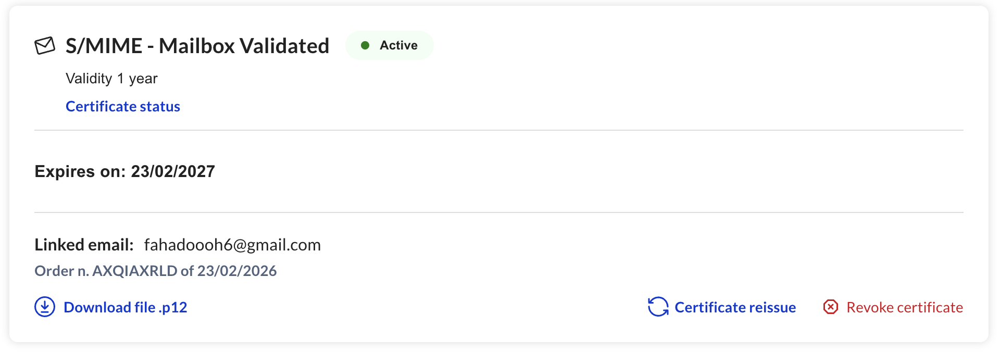
*بعد التأكيد، ستظهر الشهادة في حسابك باللون الأخضر (Active).*

---

### 📥 الخطوة 3: تحميل الشهادة وحفظ الباسورد (مهم جداً)
1. ارجع لموقع Actalis، واعمل تحديث (Refresh) للصفحة.
2. راح تلاحظ أن الشهادة تفعلت، اضغط على زر **DownloadFile .p12** لتحميل ملف الشهادة على كمبيوترك.
3. في نفس هذا الوقت، **الشركة أرسلت لك إيميل أخير يحتوي على الباسورد (الرقم السري) الخاص بشهادتك**.
4. افتح إيميلك، انسخ هذا الباسورد الطويل، واحفظه في ملف نصي (مفكرة) بجانب ملف الشهادة اللي حملته.

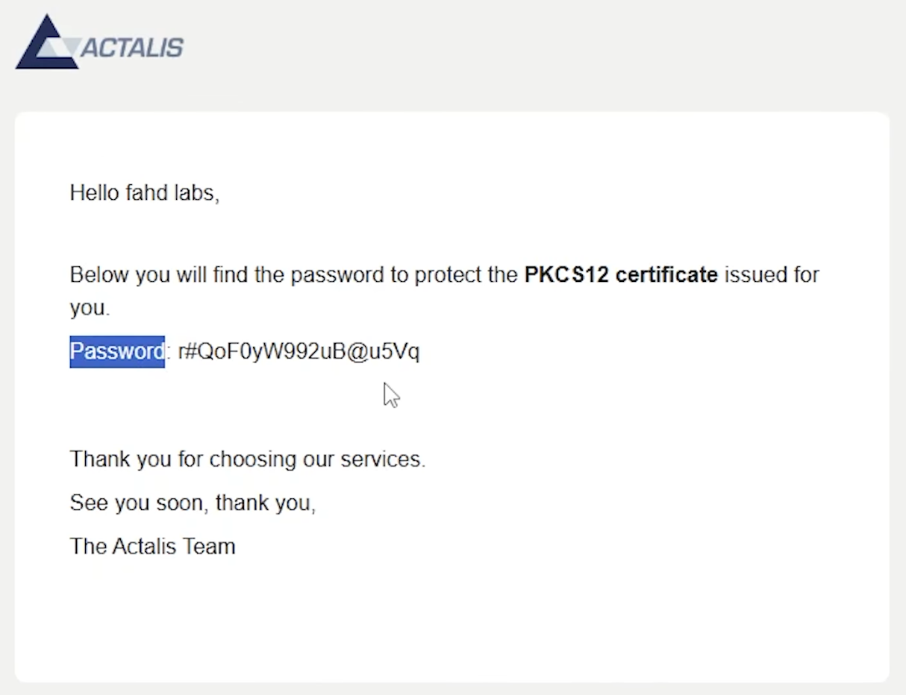
*هذا الإيميل يحتوي على الباسورد الخاص بشهادتك، حافظ عليه لأنك ستحتاجه في الخطوات القادمة.*

> **💡 حيلة بسيطة:** عشان نسهل على نفسنا التثبيت في الجوال لاحقاً، افتح إيميلك وأرسل رسالة **لنفسك**، أرفق فيها ملف الشهادة (.p12) واكتب الباسورد في نص الرسالة. 

---

### 💻 الخطوة 4: التثبيت على الكمبيوتر (ويندوز - برنامج Outlook)
إذا كنت تستخدم ويندوز، برنامج "الأوتلوك" (Outlook Classic) هو الأفضل لإرسال الإيميلات الموثقة.

**أولاً: تعريف الويندوز على الشهادة:**
1. روح لملف الشهادة اللي حملته (.p12) واضغط عليه مرتين كأنك تفتح أي برنامج.
2. بتطلع لك نافذة، اضغط **Next** ثم **Next**.
3. راح يطلب منك **الباسورد**، اكتب الباسورد اللي أرسلوه لك بالإيميل.
4. **خطوة مهمة:** حط صح على المربع اللي مكتوب فيه `Mark this key as exportable` (عشان تقدر تنقل الشهادة مستقبلاً).
5. اضغط **Next** ثم **Finish**، وبتطلع لك رسالة بنجاح التثبيت.

**ثانياً: تفعيل التوثيق داخل Outlook:**
1. افتح برنامج الأوتلوك، واضغط فوق يسار على **ملف (File)** ثم **خيارات (Options)**.
2. اختر **Trust Center** (مركز التوثيق) من اليسار، ثم اضغط زر **Trust Center Settings**.
3. من القائمة اليسرى اختر **Email Security** (أمان الإيميل)، ثم اضغط على زر **Settings** (الإعدادات).
4. اضغط على **New** (جديد) واكتب أي اسم في المربع الأول.
5. عند خيار `Signing Certificate` اضغط على زر **Choose**، واختار إيميلك من القائمة واضغط OK.
6. **ملاحظة هامة جداً:** عند خيار `Hash Algorithm`، غيره إلى **SHA256** (هذا يخلي التوثيق يشتغل على كل الأجهزة الحديثة بدون مشاكل).
7. حط علامة صح على خيار `Add digital signature to outgoing messages` (عشان يتوثق كل إيميل ترسله تلقائياً). واضغط OK لكل النوافذ.

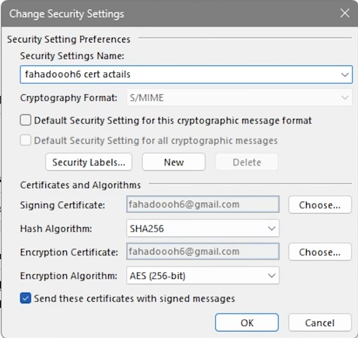
*تأكد من اختيار SHA256 لضمان أفضل توافق مع جميع الأجهزة.*

🎉 **مبروك!** جرب الآن ترسل إيميل من الأوتلوك، وراح تلاحظ علامة التوثيق موجودة.

---

### 📱 الخطوة 5: التثبيت على الآيفون (تطبيق Mail الرسمي)
إذا تبي ترسل إيميلاتك الموثقة من جوالك الآيفون بكل سهولة:

1. تذكر الإيميل اللي أرسلته لنفسك في الخطوة 3؟ افتحه من جوالك الآيفون.
2. اضغط على ملف الشهادة المرفق. راح تطلع لك رسالة تقول `Profile Downloaded` (تم تنزيل ملف التعريف).
3. روح لـ **إعدادات الآيفون (Settings)** > **عام (General)** > انزل تحت واختر **VPN وإدارة الجهاز**.
4. راح تلاقي الشهادة موجودة، اضغط عليها واعمل **تثبيت (Install)**. (بيطلب رمز قفل شاشتك، ثم بيطلب باسورد الشهادة اللي ارسلوه لك).

**خطوة إجبارية للآيفون فقط (الشهادة الوسيطة):**
الآيفون نظام حمايته عالي ويحتاج يتعرف على الشركة الأم اللي أصدرت الشهادة.
- انسخ هذا الرابط وافتحه في متصفح سفاري بجوالك:[http://cacert.actalis.it/certs/actalis-autclig3](http://cacert.actalis.it/certs/actalis-autclig3)
- راح يحمل ملف تعريف (Profile) جديد، روح للإعدادات وثبته بنفس الطريقة اللي سويناها قبل شوي.

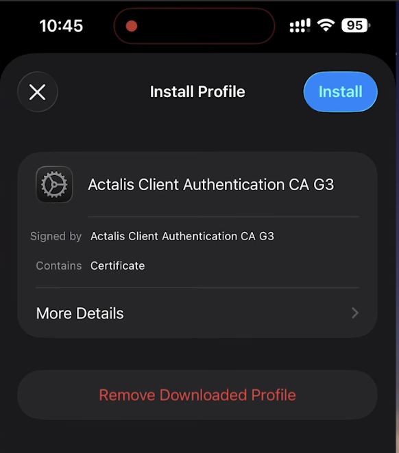
*هذه الشهادة ضرورية للآيفون لكي يتعرف على شهادة التوثيق.*

**تفعيل التوثيق في تطبيق الإيميل:**
1. روح لـ **إعدادات الآيفون** > انزل لتطبيق **البريد (Mail)** > **الحسابات (Accounts)**.
2. ادخل على حساب الإيميل حقك > ثم اضغط على إعدادات الحساب > وانزل تحت واختر **متقدم (Advanced)**.
3. انزل لآخر الصفحة لقسم اسمه **S/MIME**، واضغط على خيار التوقيع **Sign**.
4. فعّل الزر (خليه أخضر)، وتحت راح تلاقي الشهادة اللي ثبتناها، تأكد إن عليها علامة (صح).

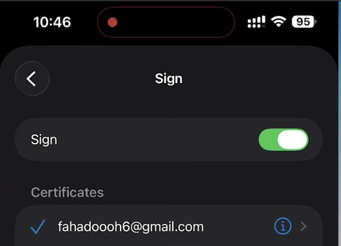
*تفعيل خيار Sign ليقوم الآيفون بوضع علامة التوثيق على رسائلك.*

---

### ✨ النتيجة النهائية: إيميلك الآن احترافي وموثق!

الآن أنت جاهز! افتح تطبيق الإيميل في الآيفون (أو الأوتلوك في الكمبيوتر) وجرب اكتب رسالة جديدة، راح تلاحظ ظهور كلمة **Signed (مُوَقّع)** باللون الأزرق فوق.

أرسل الإيميل لنفسك أو لصديقك، وبمجرد ما يفتح المستلم الرسالة (في Gmail مثلاً)، راح يشوف **علامة التوثيق الرسمية** بجانب إيميلك!

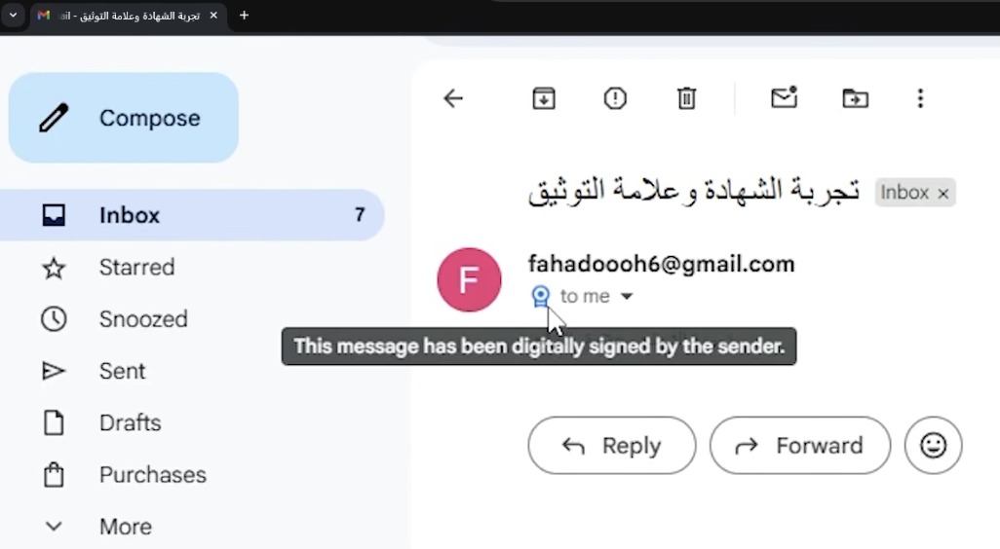
*كذا بتظهر رسائلك للمستلمين.. على الجيميل من المتصفح!*

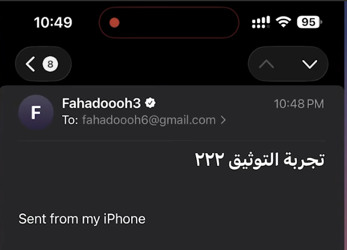
*كذا بتظهر رسائلك للمستلمين.. على تطبيق الايميل على الايفون!*

---

🎁 <b>شرح إضافي: تثبيت الشهادة لأجهزة ماك (Mac) وتطبيق Outlook</b> (اضغط للفتح)

بناءً على طلب أحد المتابعين، هذا شرح إضافي لكيفية تثبيت الشهادة على نظام **الماك (macOS)** واستخدامها في تطبيق Outlook. نظام الماك يعتمد على تطبيق خاص بالحماية اسمه "وصول سلسلة المفاتيح" (Keychain Access).

**أولاً: إدخال الشهادة في الماك:**
1. افتح ملف الشهادة `.p12` الذي قمت بتحميله بالضغط عليه مرتين.
2. سيفتح لك تطبيق **Keychain Access**، وسيطلب منك الباسورد الخاص بالشهادة (الباسورد الذي وصلك في الإيميل).
3. اختر إضافة الشهادة إلى سلسلة مفاتيح **تسجيل الدخول (login)**.

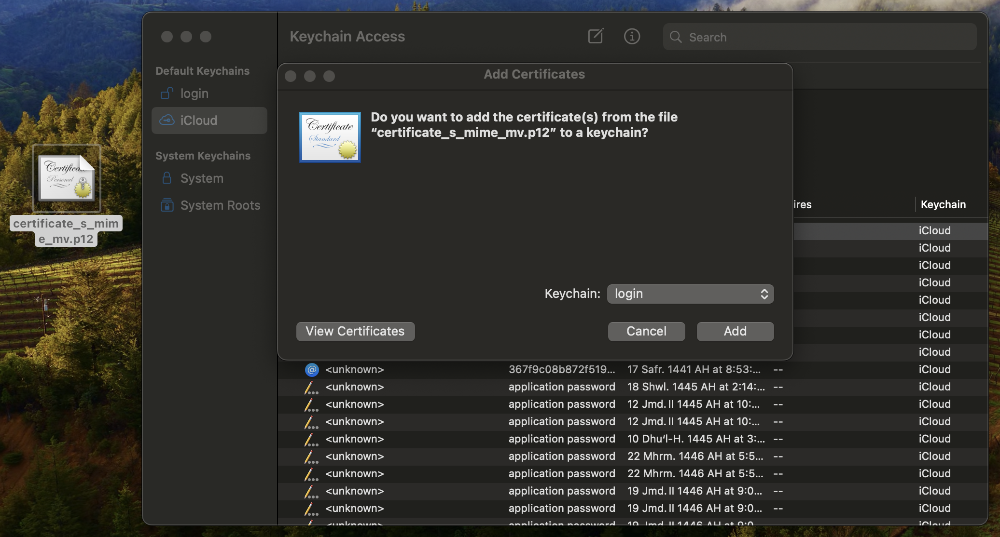
*إضافة الشهادة إلى Keychain Access*

> **ملاحظة:** ضروري تغيرها من "iCloud" إلى "login" (أو تسجيل الدخول بالعربي) ثم تضغط "Add" لإضافة الشهادة. بيطلب منك الماك باسورد الشهادة، اكتبه وكمل الإضافة.

**ثانياً: خطوة "الوثوق" الإجبارية في الماك (Trust):**
هذه الخطوة مهمة جداً وبدونها لن يعمل التوثيق:
1. داخل تطبيق Keychain Access، ابحث عن اسم إيميلك أو شهادة Actalis.
2. اضغط عليها بزر الماوس الأيمن (Right-click) واختر **إحضار المعلومات (Get Info)**.
3. افتح السهم بجانب كلمة **الثقة (Trust)**.
4. عند خيار "عند استخدام هذه الشهادة" (When using this certificate)، قم بتغييره من الافتراضي إلى **الوثوق دائماً (Always Trust)**.
5. أغلق النافذة، سيطلب منك الماك إدخال (الرقم السري الخاص بجهاز الماك نفسه) لتأكيد هذا التعديل.

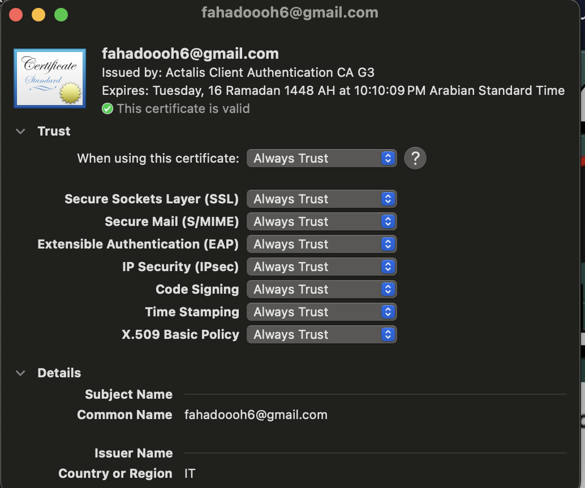
*تغيير إعدادات الثقة إلى Always Trust خطوة لا غنى عنها في الماك.*

**ثالثاً: تفعيل التوثيق داخل تطبيق Outlook للماك:**
1. افتح تطبيق **Microsoft Outlook** على جهاز الماك.
2. من الشريط العلوي، اضغط على كلمة **Outlook** ثم **الإعدادات/التفضيلات (Settings/Preferences)**.
3. ادخل على قسم **الحسابات (Accounts)**.

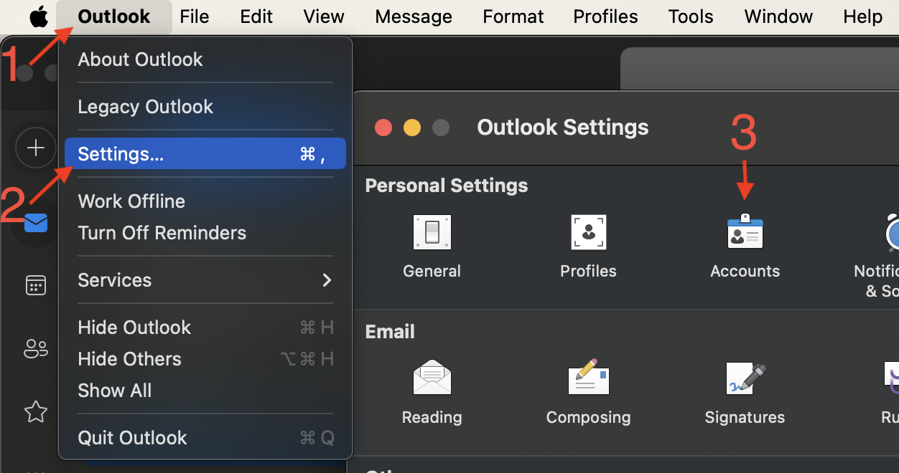

4. إضغط على إيميلك ثم اضغط على **إعداد (Configure)** مقابل كلمة **الأمان (Security)**.

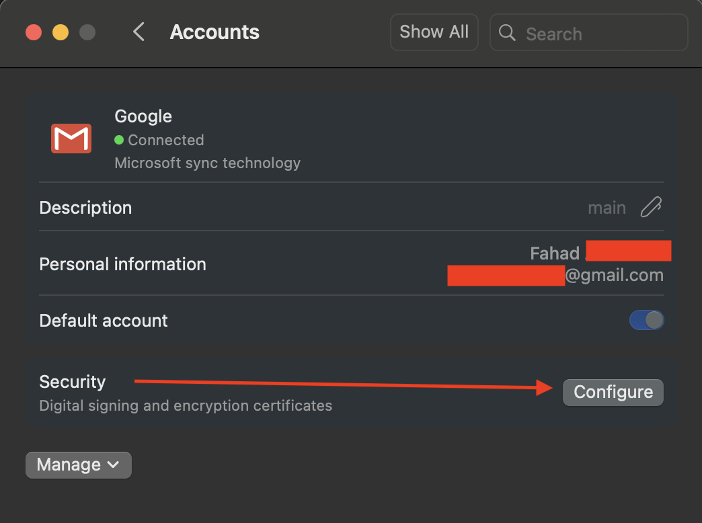

5. في قسم التوقيع الرقمي (Digital signing)، افتح القائمة المنسدلة واختر الشهادة الخاصة بك.
6. ضع علامة (صح) على خيار **توقيع الرسائل الصادرة (Sign outgoing messages)**.

> ⚠️ **تنبيه هام جداً:** تأكد أن خيار **تشفير الرسائل الصادرة (Encrypt outgoing messages)** الموجود في نفس هذه الصفحة **غير مُفعل (بدون علامة صح)**. التشفير يتطلب أن يكون المستلم لديه شهادة أيضاً، وإذا فعلته ستظهر لك رسالة خطأ تمنعك من الإرسال. نحن نحتاج التوقيع (Sign) فقط!

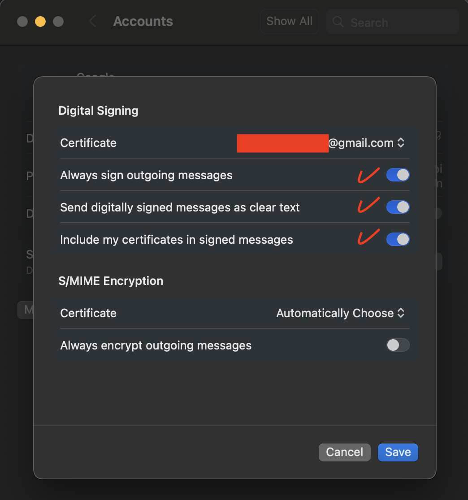
*تأكد من اختيار الشهادة لتوقيع الرسائل، وترك خيار التشفير فارغاً.*

**تجربة الإرسال:**
الآن، عند فتح نافذة رسالة جديدة، ستلاحظ وجود علامة (قفل أو ختم توثيق) تخبرك بأن الرسالة سيتم توقيعها رقمياً (Signed).

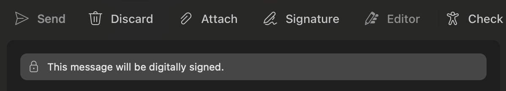
*علامة التوثيق ظاهرة وجاهزة للإرسال في الماك*

 

**أتمنى أن يكون الشرح واضح وسهل للجميع.** إذا واجهتك أي مشكلة، لا تتردد في إعادة مشاهدة الفيديو، أو ترك تعليق وسأكون سعيداً بمساعدتك. لا تنسَ تشارك الفيديو مع أصحابك اللي يحتاجون يخلون إيميلاتهم احترافية!